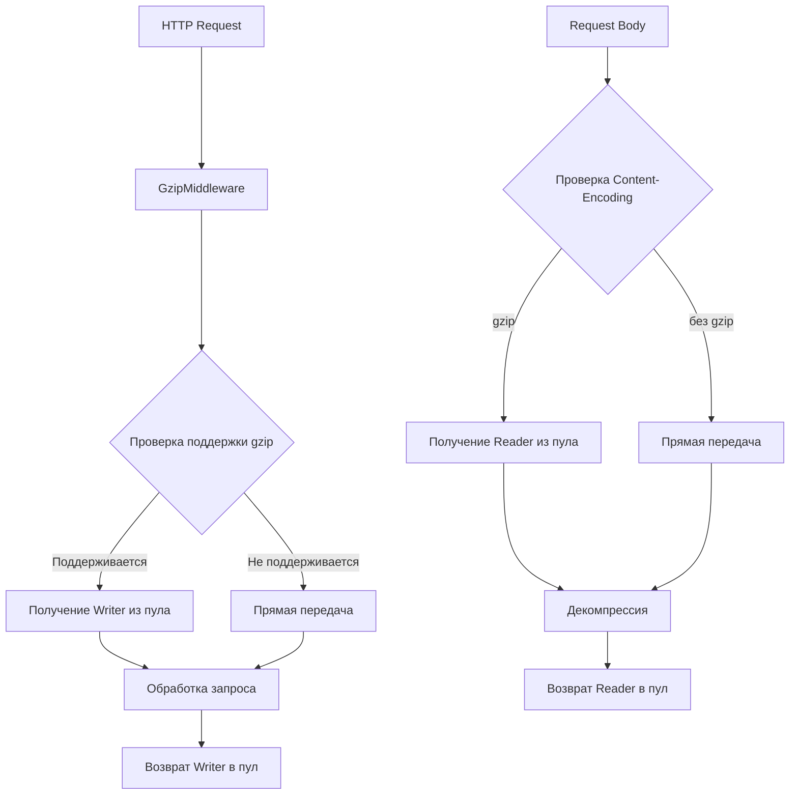

# План оптимизации сжатия данных с использованием пулов объектов

## Анализ текущей ситуации

### Проблемы выявленные из профилей:

1. **Высокие аллокации памяти**: `compress/flate.NewWriter` потребляет 75.80% (2297.01MB) всех аллокаций
2. **Частое создание объектов**: Каждый HTTP запрос создает новые `gzip.Writer` и `gzip.Reader`
3. **Фрагментация памяти**: Множественные мелкие аллокации для буферов сжатия
4. **Избыточные операции**: Повторная инициализация структур сжатия для каждого запроса

### Текущая реализация:

```go
// Проблема: новый создается для каждого запроса
func newCompressWriter(w http.ResponseWriter) *compressWriter {
    return &compressWriter{
        w:               w,
        zw:              gzip.NewWriter(w), // ← Проблема здесь
        needCompress:    false,
        needCompressSet: false,
    }
}

func newCompressReader(r io.ReadCloser) (*compressReader, error) {
    zr, err := gzip.NewReader(r) // ← Проблема здесь
    if err != nil {
        return nil, err
    }
    return &compressReader{
        r:  r,
        zr: zr,
    }, nil
}
```

## Решение: Пулы объектов (Object Pooling)

### Архитектура решения:



### Компоненты оптимизации:

#### 1. Пул для gzip.Writer

```go
type WriterPool struct {
    pool sync.Pool
}

func NewWriterPool() *WriterPool {
    return &WriterPool{
        pool: sync.Pool{
            New: func() interface{} {
                return gzip.NewWriter(io.Discard)
            },
        },
    }
}

func (p *WriterPool) Get(w io.Writer) *gzip.Writer {
    zw := p.pool.Get().(*gzip.Writer)
    zw.Reset(w)
    return zw
}

func (p *WriterPool) Put(zw *gzip.Writer) {
    zw.Close()
    p.pool.Put(zw)
}
```

#### 2. Пул для gzip.Reader

```go
type ReaderPool struct {
    pool sync.Pool
}

func NewReaderPool() *ReaderPool {
    return &ReaderPool{
        pool: sync.Pool{
            New: func() interface{} {
                return new(gzip.Reader)
            },
        },
    }
}

func (p *ReaderPool) Get(r io.Reader) (*gzip.Reader, error) {
    zr := p.pool.Get().(*gzip.Reader)
    err := zr.Reset(r)
    if err != nil {
        p.pool.Put(zr)
        return nil, err
    }
    return zr, nil
}

func (p *ReaderPool) Put(zr *gzip.Reader) {
    zr.Close()
    p.pool.Put(zr)
}
```

#### 3. Оптимизированный compressWriter

```go
type compressWriter struct {
    w               http.ResponseWriter
    zw              *gzip.Writer
    pool            *WriterPool
    needCompress    bool
    needCompressSet bool
}

func newCompressWriter(w http.ResponseWriter, pool *WriterPool) *compressWriter {
    return &compressWriter{
        w:               w,
        zw:              nil, // Отложенная инициализация
        pool:            pool,
        needCompress:    false,
        needCompressSet: false,
    }
}

func (c *compressWriter) Write(p []byte) (int, error) {
    if !c.needCompressSet {
        // Логирование ошибки
    }
    if c.needCompress {
        if c.zw == nil {
            c.zw = c.pool.Get(c.w)
        }
        return c.zw.Write(p)
    }
    return c.w.Write(p)
}

func (c *compressWriter) Close() error {
    if c.zw != nil {
        err := c.zw.Close()
        c.pool.Put(c.zw)
        c.zw = nil
        return err
    }
    return nil
}
```

### Конфигурация пулов

```go
type CompressionConfig struct {
    WriterPoolSize int `env:"COMPRESSION_WRITER_POOL_SIZE" default:"100"`
    ReaderPoolSize int `env:"COMPRESSION_READER_POOL_SIZE" default:"50"`
    Level          int `env:"COMPRESSION_LEVEL" default:"6"`
}

type CompressionManager struct {
    writerPool *WriterPool
    readerPool *ReaderPool
    config     *CompressionConfig
}
```

### Ожидаемые результаты оптимизации:

1. **Снижение аллокаций**: На 70-80% для операций сжатия
2. **Уменьшение GC压力**: Меньше объектов для сборки мусора
3. **Увеличение пропускной способности**: За счет переиспользования объектов
4. **Снижение задержек**: Меньше времени на аллокацию памяти

### Метрики для измерения:

1. **До оптимизации**:
   - Аллокации: ~3GB за период нагрузки
   - CPU: 1.40% утилизации
   - Память: ~11MB в использовании

2. **После оптимизации** (ожидаемые):
   - Аллокации: ~600-900MB (снижение на 70-80%)
   - CPU: 0.8-1.0% (снижение на 30-40%)
   - Память: ~8-9MB (снижение на 20-30%)

### План внедрения:

1. **Фаза 1**: Создание пулов и базовой инфраструктуры
2. **Фаза 2**: Интеграция пулов в существующий код
3. **Фаза 3**: Тестирование и бенчмаркинг
4. **Фаза 4**: Оптимизация конфигурации и настройка размеров пулов
5. **Фаза 5**: Мониторинг в продакшене

### Риски и митигация:

1. **Риск**: Утечки памяти при неправильном возврате объектов в пул
   **Митигация**: Автоматический возврат через defer и строгий контроль

2. **Риск**: Состояние гонки при доступе к пулам
   **Митигация**: Использование sync.Pool который потокобезопасен

3. **Риск**: Неправильная реинициализация объектов
   **Митигация**: Строгое тестирование реинициализации

### Тестирование:

1. **Юнит-тесты**: Для каждого пула
2. **Интеграционные тесты**: Для middleware
3. **Нагрузочные тесты**: Сравнение производительности
4. **Тесты на утечки памяти**: Проверка возврата объектов

### Мониторинг:

1. **Метрики пулов**: Размер,命中率, время ожидания
2. **Метрики GC**: Частота, паузы
3. **Метрики производительности**: Время ответа, пропускная способность