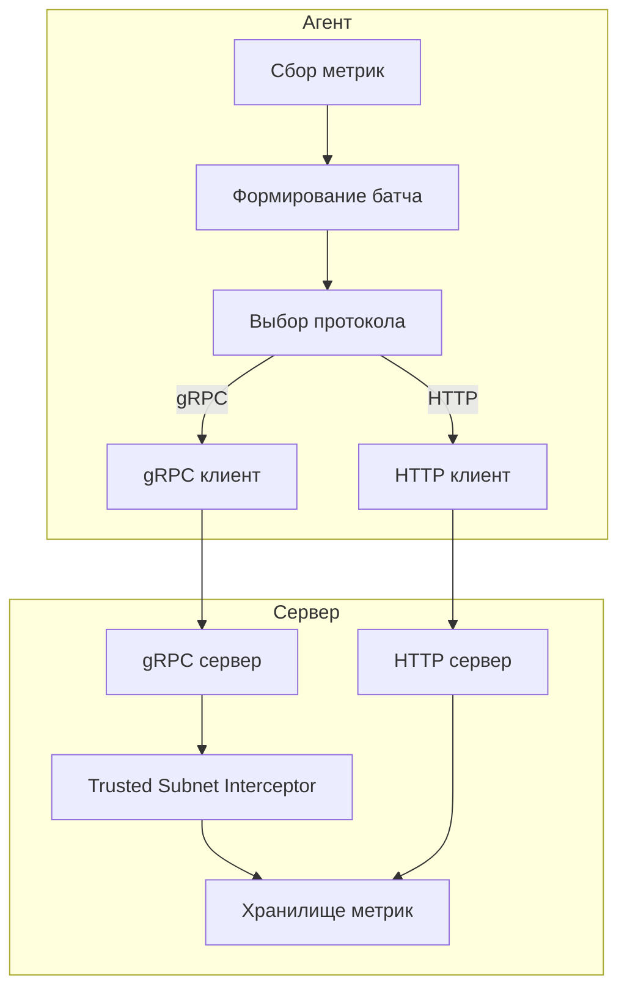

# План реализации gRPC интеграции

## Обзор

Добавление возможности обмена данными между сервером и агентом по протоколу gRPC. gRPC будет работать параллельно с существующим HTTP-протоколом.

## Архитектура



## Детальный план

### 1. Proto-файл и генерация кода

**Файл:** `api/metrics.proto`

```protobuf
syntax = "proto3";

package metrics;

option go_package = "github.com/paxren/metrics/internal/proto";

message Metric {
  string id = 1;
  enum MType {
    GAUGE = 0;
    COUNTER = 1;
  }
  MType type = 2;
  int64 delta = 3;
  double value = 4;
}

message UpdateMetricsRequest {
  repeated Metric metrics = 1;
}

message UpdateMetricsResponse {}

service Metrics {
  rpc UpdateMetrics(UpdateMetricsRequest) returns (UpdateMetricsResponse);
}
```

**Зависимости для добавления в go.mod:**
- `google.golang.org/grpc`
- `google.golang.org/protobuf`

**Команда генерации:**
```bash
protoc --go_out=. --go_opt=paths=source_relative \
       --go-grpc_out=. --go-grpc_opt=paths=source_relative \
       api/metrics.proto
```

### 2. Конфигурация

#### ServerConfig (`internal/config/server.go`)

Добавить поля:
```go
type ServerConfig struct {
    // ... существующие поля
    GRPCAddress HostAddress
    paramGRPCAddress HostAddress
}
```

Добавить флаг:
```go
flag.Var(&se.paramGRPCAddress, "grpc-a", "gRPC server address host:port")
```

Добавить переменную окружения:
```go
type ServerConfigEnv struct {
    // ... существующие поля
    GRPCAddress HostAddress `env:"GRPC_ADDRESS,notEmpty"`
}
```

#### AgentConfig (`internal/config/agent.go`)

Добавить поля:
```go
type AgentConfig struct {
    // ... существующие поля
    GRPCAddress HostAddress
    paramGRPCAddress HostAddress
}
```

Добавить флаг:
```go
flag.Var(&ac.paramGRPCAddress, "grpc-a", "gRPC server address host:port")
```

Добавить переменную окружения:
```go
type AgentConfigEnv struct {
    // ... существующие поля
    GRPCAddress HostAddress `env:"GRPC_ADDRESS,notEmpty"`
}
```

### 3. gRPC-сервер

**Файл:** `internal/grpc/server.go`

```go
package grpc

import (
    "context"
    "net"

    "github.com/paxren/metrics/internal/config"
    "github.com/paxren/metrics/internal/handler"
    "github.com/paxren/metrics/internal/proto"
    "github.com/paxren/metrics/internal/repository"
    "go.uber.org/zap"
    "google.golang.org/grpc"
    "google.golang.org/grpc/codes"
    "google.golang.org/grpc/status"
)

type Server struct {
    proto.UnimplementedMetricsServer
    storage   repository.Repository
    logger    *zap.Logger
    subnetMW  *handler.TrustedSubnetMiddleware
}

func NewServer(
    storage repository.Repository,
    logger *zap.Logger,
    subnetMW *handler.TrustedSubnetMiddleware,
) *Server {
    return &Server{
        storage:  storage,
        logger:   logger,
        subnetMW: subnetMW,
    }
}

func (s *Server) UpdateMetrics(
    ctx context.Context,
    req *proto.UpdateMetricsRequest,
) (*proto.UpdateMetricsResponse, error) {
    // Проверка доверенной подсети через метаданные
    if err := s.checkTrustedSubnet(ctx); err != nil {
        return nil, err
    }

    // Конвертация и сохранение метрик
    for _, m := range req.Metrics {
        // Конвертация proto.Metric в models.Metrics
        // Сохранение в хранилище
    }

    return &proto.UpdateMetricsResponse{}, nil
}

func (s *Server) checkTrustedSubnet(ctx context.Context) error {
    // Получение IP из метаданных "x-real-ip"
    // Проверка через TrustedSubnetMiddleware
}

// TrustedSubnetInterceptor - UnaryInterceptor для проверки подсети
func TrustedSubnetInterceptor(subnetMW *handler.TrustedSubnetMiddleware) grpc.UnaryServerInterceptor {
    return func(
        ctx context.Context,
        req interface{},
        info *grpc.UnaryServerInfo,
        handler grpc.UnaryHandler,
    ) (interface{}, error) {
        // Проверка IP из метаданных
        // Если не проходит - возвращаем codes.PermissionDenied
    }
}

func StartServer(
    cfg *config.ServerConfig,
    storage repository.Repository,
    logger *zap.Logger,
    subnetMW *handler.TrustedSubnetMiddleware,
) (*grpc.Server, error) {
    // Создание gRPC-сервера с interceptor
    // Регистрация сервиса Metrics
    // Запуск на cfg.GRPCAddress
}
```

### 4. gRPC-клиент

**Файл:** `internal/grpc/client.go`

```go
package grpc

import (
    "context"
    "net"

    "github.com/paxren/metrics/internal/config"
    "github.com/paxren/metrics/internal/models"
    "github.com/paxren/metrics/internal/proto"
    "google.golang.org/grpc"
    "google.golang.org/grpc/credentials/insecure"
)

type Client struct {
    conn   *grpc.ClientConn
    client proto.MetricsClient
    localIP string
}

func NewClient(cfg *config.AgentConfig) (*Client, error) {
    // Подключение к gRPC-серверу
    // Получение локального IP
}

func (c *Client) SendMetrics(ctx context.Context, metrics []models.Metrics) error {
    // Конвертация []models.Metrics в proto.UpdateMetricsRequest
    // Добавление IP в метаданные "x-real-ip"
    // Отправка через UpdateMetrics
}

func (c *Client) Close() error {
    // Закрытие соединения
}
```

### 5. Интеграция в сервер

**Файл:** `cmd/server/main.go`

```go
// После инициализации HTTP-сервера

// Запуск gRPC-сервера, если указан адрес
if serverConfig.GRPCAddress.Host != "" {
    grpcServer, err := grpc.StartServer(
        serverConfig,
        storage,
        logger,
        trustedSubnetMW,
    )
    if err != nil {
        sugar.Fatal("Failed to start gRPC server", "error", err)
    }
    defer grpcServer.Stop()

    sugar.Infow("gRPC server started", "address", serverConfig.GRPCAddress)
}
```

### 6. Интеграция в агент

**Файл:** `internal/agent/agent.go`

Добавить поле:
```go
type Agent struct {
    // ... существующие поля
    grpcClient *grpc.Client
    useGRPC    bool
}
```

Модифицировать `NewAgentExtended`:
```go
func NewAgentExtended(
    host config.HostAddress,
    grpcAddr config.HostAddress,
    key string,
    num int64,
    pollInterval int64,
    reportInterval int64,
    cryptoKeyPath string,
) *Agent {
    // ... существующая инициализация

    // Инициализация gRPC-клиента, если указан адрес
    if grpcAddr.Host != "" {
        grpcClient, err := grpc.NewClient(&config.AgentConfig{
            GRPCAddress: grpcAddr,
        })
        if err != nil {
            fmt.Printf("Failed to create gRPC client: %v\n", err)
        } else {
            agent.grpcClient = grpcClient
            agent.useGRPC = true
        }
    }
}
```

Модифицировать метод отправки метрик:
```go
func (a *Agent) sendMetrics(metrics []models.Metrics) error {
    if a.useGRPC && a.grpcClient != nil {
        return a.grpcClient.SendMetrics(context.Background(), metrics)
    }
    // Иначе отправка через HTTP
    return a.sendMetricsHTTP(metrics)
}
```

### 7. Конфигурационные файлы

**Файл:** `examples/server_config.json`

```json
{
  "address": "localhost:8080",
  "grpc_address": "localhost:3200",
  "store_interval": 300,
  "file_storage_path": "save_file",
  "database_dsn": "",
  "restore": true,
  "key": "",
  "crypto_key": "",
  "trusted_subnet": "192.168.1.0/24"
}
```

**Файл:** `examples/agent_config.json`

```json
{
  "address": "localhost:8080",
  "grpc_address": "localhost:3200",
  "report_interval": 10,
  "poll_interval": 2,
  "rate_limit": 1,
  "key": "",
  "crypto_key": ""
}
```

### 8. Тесты

**Файл:** `internal/grpc/server_test.go`

- Тест UpdateMetrics с валидными метриками
- Тест UpdateMetrics с пустым батчем
- Тест проверки доверенной подсети
- Тест с недопустимым IP

**Файл:** `internal/grpc/client_test.go`

- Тест подключения к серверу
- Тест отправки метрик
- Тест конвертации моделей

## Порядок выполнения

1. Создать proto-файл
2. Добавить зависимости в go.mod
3. Сгенерировать Go-код
4. Добавить конфигурационные параметры
5. Реализовать gRPC-сервер
6. Реализовать gRPC-клиент
7. Интегрировать в cmd/server/main.go
8. Интегрировать в internal/agent/agent.go
9. Написать тесты
10. Обновить документацию

## Заметки

- gRPC-сервер будет работать на отдельном порту (по умолчанию :3200)
- Проверка доверенной подсети выполняется через UnaryInterceptor
- IP-адрес передаётся через метаданные с ключом "x-real-ip"
- Агент может использовать либо HTTP, либо gRPC в зависимости от конфигурации
- Если указан gRPC-адрес, агент будет использовать gRPC, иначе HTTP
