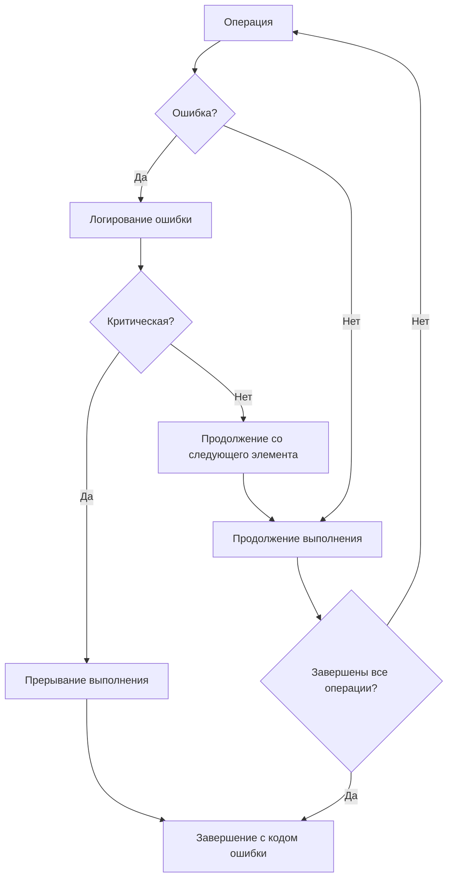

# Workflow утилиты генерации методов Reset()

## Диаграмма процесса

```mermaid
flowchart TD
    A[Запуск утилиты] --> B[Сканирование пакетов]
    B --> C[Загрузка AST для каждого пакета]
    C --> D[Поиск структур с комментарием // generate:reset]
    D --> E[Анализ полей каждой структуры]
    E --> F{Тип поля}
    
    F -->|Примитивный| G[Генерация кода для примитива]
    F -->|Слайс| H[Генерация кода для слайса]
    F -->|Мапа| I[Генерация кода для мапы]
    F -->|Указатель| J[Генерация кода для указателя]
    F -->|Структура| K[Генерация кода для структуры]
    
    G --> L[Добавление кода в буфер]
    H --> L
    I --> L
    J --> L
    K --> L
    
    L --> M{Есть ещё поля?}
    M -->|Да| E
    M -->|Нет| N[Формирование метода Reset()]
    
    N --> O{Есть ещё структуры?}
    O -->|Да| E
    O -->|Нет| P[Запись в reset.gen.go]
    
    P --> Q[Форматирование кода]
    Q --> R[Сохранение файла]
    R --> S[Завершение работы]
```

## Детальная диаграмма обработки типов

```mermaid
flowchart TD
    A[Анализ типа поля] --> B{Базовый тип?}
    B -->|Да| C{Примитивный?}
    B -->|Нет| D{Слайс?}
    B -->|Нет| E{Мапа?}
    B -->|Нет| F{Указатель?}
    B -->|Нет| G{Структура?}
    
    C -->|Да| H[int/string/bool → 0/""/false]
    C -->|Нет| I[Другой базовый тип]
    
    D -->|Да| J[slice = slice[:0]]
    
    E -->|Да| K[clear(map)]
    
    F -->|Да| L{На примитив?}
    L -->|Да| M[Разыменование и сброс]
    L -->|Нет| N{На структуру?}
    N -->|Да| O[Вызов Reset() если есть]
    N -->|Нет| P[Присвоение nil]
    
    G -->|Да| Q{Есть метод Reset()?}
    Q -->|Да| R[Вызов метода]
    Q -->|Нет| S[Рекурсивная обработка полей]
```

## Последовательность операций

### 1. Инициализация
```
1. Создание экземпляра ResetGenerator
2. Настройка FileSet для отслеживания позиций
3. Определение корневой директории проекта
```

### 2. Сканирование пакетов
```
1. Использование packages.Load для загрузки всех пакетов
2. Фильтрация тестовых файлов
3. Получение AST для каждого пакета
```

### 3. Поиск структур
```
1. Итерация по всем файлам в пакете
2. Поиск объявлений типов (GenDecl)
3. Фильтрация только структур (StructType)
4. Проверка наличия комментария // generate:reset
```

### 4. Анализ полей
```
1. Извлечение списка полей структуры
2. Определение типа каждого поля
3. Сохранение информации о поле для генерации
```

### 5. Генерация кода
```
1. Создание шаблона метода Reset()
2. Для каждого поля:
   - Определение типа
   - Выбор соответствующего обработчика
   - Генерация кода сброса
3. Компоновка полного метода
```

### 6. Запись файлов
```
1. Группировка структур по пакетам
2. Создание содержимого файла reset.gen.go
3. Форматирование кода с помощью go/format
4. Запись файла в соответствующую директорию
```

## Обработка ошибок



## Пример обработки структуры

### Входная структура:
```go
// generate:reset
type Example struct {
    Count    int
    Name     string
    Items    []string
    Config   map[string]string
    Pointer  *int
    Nested   *NestedStruct
}
```

### Процесс обработки:
1. **Поле Count (int)**: `s.Count = 0`
2. **Поле Name (string)**: `s.Name = ""`
3. **Поле Items ([]string)**: `s.Items = s.Items[:0]`
4. **Поле Config (map[string]string)**: `clear(s.Config)`
5. **Поле Pointer (*int)**: 
   ```go
   if s.Pointer != nil {
       *s.Pointer = 0
   }
   ```
6. **Поле Nested (*NestedStruct)**:
   ```go
   if resetter, ok := s.Nested.(interface{ Reset() }); ok && s.Nested != nil {
       resetter.Reset()
   }
   ```

### Результат:
```go
func (e *Example) Reset() {
    if e == nil {
        return
    }

    e.Count = 0
    e.Name = ""
    e.Items = e.Items[:0]
    clear(e.Config)
    if e.Pointer != nil {
        *e.Pointer = 0
    }
    if resetter, ok := e.Nested.(interface{ Reset() }); ok && e.Nested != nil {
        resetter.Reset()
    }
}
```

## Оптимизации

### 1. Кэширование информации о типах
- Сохранение проанализированных типов
- Повторное использование для полей с одинаковыми типами

### 2. Параллельная обработка
- Обработка разных пакетов в параллельных горутинах
- Синхронизация при записи файлов

### 3. Инкрементальная генерация
- Проверка времени изменения файлов
- Перегенерация только изменённых пакетов

## Метрики производительности

### Измеряемые параметры:
- Время сканирования пакетов
- Время анализа структур
- Время генерации кода
- Время записи файлов
- Объём сгенерированного кода

### Целевые показатели:
- Обработка проекта до 1000 файлов за < 10 секунд
- Использование памяти < 100MB
- Корректная обработка 99% случаев использования