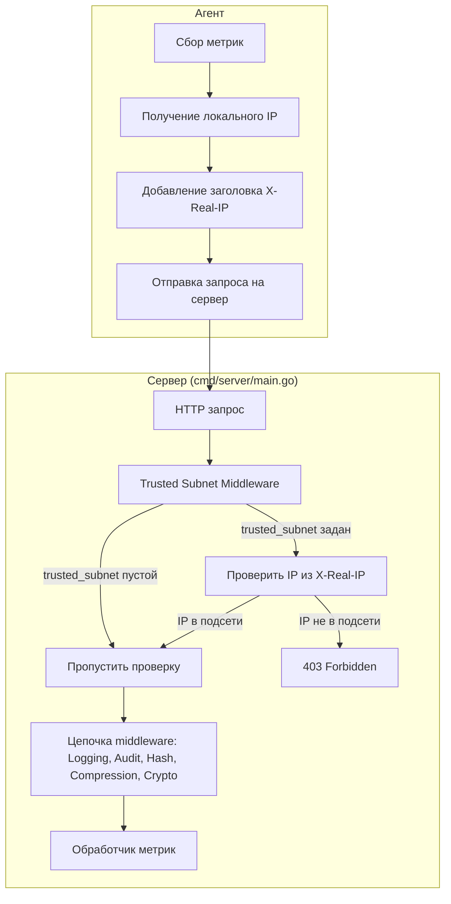

# План реализации проверки доверенной подсети (Trusted Subnet)

## Обзор задачи

Добавить функционал проверки доверенной подсети для сервера метрик:
- Добавить поле `trusted_subnet` в конфигурацию сервера (флаг `-t`, переменная `TRUSTED_SUBNET`)
- Добавить заголовок `X-Real-IP` в запросы агента
- Создать middleware для проверки IP-адреса
- При пустом `trusted_subnet` - пропускать без ограничений

## Архитектура решения



## Детальный план реализации

### 1. Конфигурация сервера

#### 1.1 Обновить `internal/config/server.go`

**Добавить в `ServerConfigEnv` (строка ~15):**
```go
TrustedSubnet string `env:"TRUSTED_SUBNET,notEmpty"`
```

**Добавить в `ServerConfig` (строка ~31):**
```go
TrustedSubnet string

paramTrustedSubnet string
```

**Добавить в метод `Init()` (строка ~73):**
```go
flag.StringVar(&se.paramTrustedSubnet, "t", "", "trusted subnet in CIDR format")
```

**Добавить в метод `Parse()` (строка ~244, после CryptoKey):**
```go
// TrustedSubnet
if se.paramTrustedSubnet != "" {
    se.TrustedSubnet = se.paramTrustedSubnet
} else if _, ok := problemVars["TRUSTED_SUBNET"]; !ok && se.envs.TrustedSubnet != "" {
    se.TrustedSubnet = se.envs.TrustedSubnet
} else if fileCfg != nil && fileCfg.TrustedSubnet != "" {
    se.TrustedSubnet = fileCfg.TrustedSubnet
}
```

#### 1.2 Обновить `internal/config/file.go`

**Добавить в `ServerConfigFile` (строка ~21):**
```go
TrustedSubnet string `json:"trusted_subnet"`
```

### 2. Middleware для проверки доверенной подсети

#### 2.1 Создать `internal/handler/trusted_subnet_middleware.go`

**Структура:**
```go
package handler

import (
    "net"
    "net/http"
)

// TrustedSubnetMiddleware проверяет IP-адрес клиента на принадлежность к доверенной подсети
type TrustedSubnetMiddleware struct {
    trustedSubnet *net.IPNet
}

// NewTrustedSubnetMiddleware создаёт новый middleware для проверки доверенной подсети
//
// Параметры:
//   - cidr: строка CIDR (например, "192.168.1.0/24")
//
// Возвращает:
//   - *TrustedSubnetMiddleware: указатель на созданный middleware
//   - error: ошибка при парсинге CIDR
func NewTrustedSubnetMiddleware(cidr string) (*TrustedSubnetMiddleware, error) {
    if cidr == "" {
        return &TrustedSubnetMiddleware{trustedSubnet: nil}, nil
    }

    _, ipNet, err := net.ParseCIDR(cidr)
    if err != nil {
        return nil, err
    }

    return &TrustedSubnetMiddleware{trustedSubnet: ipNet}, nil
}

// Check проверяет IP-адрес из заголовка X-Real-IP
//
// Если trustedSubnet равен nil - пропускает запрос без проверки.
// Если IP не в доверенной подсети - возвращает 403 Forbidden.
//
// Параметры:
//   - next: следующий хендлер в цепочке
//
// Возвращает:
//   - http.HandlerFunc: middleware функция
func (tm *TrustedSubnetMiddleware) Check(next http.HandlerFunc) http.HandlerFunc {
    return func(w http.ResponseWriter, r *http.Request) {
        // Если доверенная подсеть не задана, пропускаем запрос
        if tm.trustedSubnet == nil {
            next(w, r)
            return
        }

        // Получаем IP из заголовка X-Real-IP
        realIP := r.Header.Get("X-Real-IP")
        if realIP == "" {
            http.Error(w, "X-Real-IP header is required", http.StatusForbidden)
            return
        }

        // Парсим IP-адрес
        ip := net.ParseIP(realIP)
        if ip == nil {
            http.Error(w, "Invalid IP address in X-Real-IP header", http.StatusBadRequest)
            return
        }

        // Проверяем, что IP входит в доверенную подсеть
        if !tm.trustedSubnet.Contains(ip) {
            http.Error(w, "IP address is not in trusted subnet", http.StatusForbidden)
            return
        }

        // IP в доверенной подсети, передаём управление следующему хендлеру
        next(w, r)
    }
}
```

### 3. Агент - добавление заголовка X-Real-IP

#### 3.1 Обновить `internal/agent/agent.go`

**Добавить метод получения локального IP (после строки ~115):**
```go
// getLocalIP возвращает локальный IP-адрес машины
//
// Перебирает сетевые интерфейсы и возвращает первый непустой IP-адрес,
// исключая loopback интерфейсы.
//
// Возвращает:
//   - string: строковое представление IP-адреса
//   - error: ошибка при получении IP
func (a *Agent) getLocalIP() (string, error) {
    interfaces, err := net.Interfaces()
    if err != nil {
        return "", err
    }

    for _, iface := range interfaces {
        // Пропускаем отключенные интерфейсы
        if iface.Flags&net.FlagUp == 0 {
            continue
        }

        // Пропускаем loopback интерфейсы
        if iface.Flags&net.FlagLoopback != 0 {
            continue
        }

        addrs, err := iface.Addrs()
        if err != nil {
            continue
        }

        for _, addr := range addrs {
            var ip net.IP
            switch v := addr.(type) {
            case *net.IPNet:
                ip = v.IP
            case *net.IPAddr:
                ip = v.IP
            }

            if ip == nil || ip.IsLoopback() {
                continue
            }

            // Предпочитаем IPv4
            ip = ip.To4()
            if ip == nil {
                continue
            }

            return ip.String(), nil
        }
    }

    return "", fmt.Errorf("no valid IP address found")
}
```

**Обновить метод `makeRequest()` (строка ~290, после установки заголовков):**
```go
// Добавляем заголовок X-Real-IP
localIP, err := a.getLocalIP()
if err != nil {
    errors = append(errors, fmt.Errorf("failed to get local IP: %w", err))
    return nil, errors
}
request.Header.Set("X-Real-IP", localIP)
```

**Добавить импорт `net` в начало файла (строка ~3):**
```go
import (
    "fmt"
    "math/rand/v2"
    "net"
    "runtime"
    "strconv"
    "strings"
    "sync"
    "time"
    // ... остальные импорты
)
```

### 4. Интеграция middleware в сервер

#### 4.1 Обновить `cmd/server/main.go`

**Добавить создание middleware (строка ~183, после создания cryptoMiddleware):**
```go
// Создаём middleware для проверки доверенной подсети
var trustedSubnetMW *handler.TrustedSubnetMiddleware
if serverConfig.TrustedSubnet != "" {
    trustedSubnetMW, err = handler.NewTrustedSubnetMiddleware(serverConfig.TrustedSubnet)
    if err != nil {
        sugar.Fatal(
            "Failed to parse trusted subnet",
            "error", err,
            "subnet", serverConfig.TrustedSubnet,
        )
    }
    sugar.Infow(
        "Trusted subnet middleware enabled",
        "subnet", serverConfig.TrustedSubnet,
    )
}
```

**Обновить эндпоинты для применения middleware (строки ~224-237):**

Для эндпоинта `/update/{metric_type}/{metric_name}/{metric_value}`:
```go
if trustedSubnetMW != nil {
    r.Post(`/update/{metric_type}/{metric_name}/{metric_value}`, hlog.WithLogging(auditor.WithAudit(trustedSubnetMW.Check(handlerv.UpdateMetric))))
} else {
    r.Post(`/update/{metric_type}/{metric_name}/{metric_value}`, hlog.WithLogging(auditor.WithAudit(handlerv.UpdateMetric)))
}
```

Для JSON эндпоинтов (строки ~227-237):
```go
// Для JSON эндпоинтов применяем middleware
var updateJSONHandler http.HandlerFunc
if cryptoMiddleware != nil {
    updateJSONHandler = hasher.HashMiddleware(compressor.OptimizedGzipMiddleware(cryptoMiddleware.DecryptMiddleware(handlerv.UpdateJSON)))
} else {
    updateJSONHandler = hasher.HashMiddleware(compressor.OptimizedGzipMiddleware(handlerv.UpdateJSON))
}

// Применяем trusted subnet middleware, если он настроен
if trustedSubnetMW != nil {
    updateJSONHandler = trustedSubnetMW.Check(updateJSONHandler)
}

r.Post(`/update/`, hlog.WithLogging(auditor.WithAudit(updateJSONHandler)))
r.Post(`/update`, hlog.WithLogging(auditor.WithAudit(updateJSONHandler)))
```

Аналогично для `/updates`:
```go
var updatesJSONHandler http.HandlerFunc
if cryptoMiddleware != nil {
    updatesJSONHandler = hasher.HashMiddleware(compressor.OptimizedGzipMiddleware(cryptoMiddleware.DecryptMiddleware(handlerv.UpdatesJSON)))
} else {
    updatesJSONHandler = hasher.HashMiddleware(compressor.OptimizedGzipMiddleware(handlerv.UpdatesJSON))
}

if trustedSubnetMW != nil {
    updatesJSONHandler = trustedSubnetMW.Check(updatesJSONHandler)
}

r.Post(`/updates`, hlog.WithLogging(auditor.WithAudit(updatesJSONHandler)))
r.Post(`/updates/`, hlog.WithLogging(auditor.WithAudit(updatesJSONHandler)))
```

### 5. Тестирование

#### 5.1 Тесты для middleware

**Создать `internal/handler/trusted_subnet_middleware_test.go`:**

```go
package handler

import (
    "net/http"
    "net/http/httptest"
    "testing"
)

func TestTrustedSubnetMiddleware_EmptySubnet(t *testing.T) {
    mw, err := NewTrustedSubnetMiddleware("")
    if err != nil {
        t.Fatalf("Failed to create middleware: %v", err)
    }

    nextCalled := false
    next := func(w http.ResponseWriter, r *http.Request) {
        nextCalled = true
        w.WriteHeader(http.StatusOK)
    }

    handler := mw.Check(next)

    req := httptest.NewRequest("POST", "/update", nil)
    req.Header.Set("X-Real-IP", "192.168.1.100")
    w := httptest.NewRecorder()

    handler(w, req)

    if !nextCalled {
        t.Error("Next handler should be called when subnet is empty")
    }
}

func TestTrustedSubnetMiddleware_IPInSubnet(t *testing.T) {
    mw, err := NewTrustedSubnetMiddleware("192.168.1.0/24")
    if err != nil {
        t.Fatalf("Failed to create middleware: %v", err)
    }

    nextCalled := false
    next := func(w http.ResponseWriter, r *http.Request) {
        nextCalled = true
        w.WriteHeader(http.StatusOK)
    }

    handler := mw.Check(next)

    req := httptest.NewRequest("POST", "/update", nil)
    req.Header.Set("X-Real-IP", "192.168.1.100")
    w := httptest.NewRecorder()

    handler(w, req)

    if !nextCalled {
        t.Error("Next handler should be called when IP is in subnet")
    }
}

func TestTrustedSubnetMiddleware_IPNotInSubnet(t *testing.T) {
    mw, err := NewTrustedSubnetMiddleware("192.168.1.0/24")
    if err != nil {
        t.Fatalf("Failed to create middleware: %v", err)
    }

    nextCalled := false
    next := func(w http.ResponseWriter, r *http.Request) {
        nextCalled = true
        w.WriteHeader(http.StatusOK)
    }

    handler := mw.Check(next)

    req := httptest.NewRequest("POST", "/update", nil)
    req.Header.Set("X-Real-IP", "10.0.0.1")
    w := httptest.NewRecorder()

    handler(w, req)

    if nextCalled {
        t.Error("Next handler should not be called when IP is not in subnet")
    }

    if w.Code != http.StatusForbidden {
        t.Errorf("Expected status 403, got %d", w.Code)
    }
}

func TestTrustedSubnetMiddleware_MissingHeader(t *testing.T) {
    mw, err := NewTrustedSubnetMiddleware("192.168.1.0/24")
    if err != nil {
        t.Fatalf("Failed to create middleware: %v", err)
    }

    nextCalled := false
    next := func(w http.ResponseWriter, r *http.Request) {
        nextCalled = true
        w.WriteHeader(http.StatusOK)
    }

    handler := mw.Check(next)

    req := httptest.NewRequest("POST", "/update", nil)
    w := httptest.NewRecorder()

    handler(w, req)

    if nextCalled {
        t.Error("Next handler should not be called when X-Real-IP header is missing")
    }

    if w.Code != http.StatusForbidden {
        t.Errorf("Expected status 403, got %d", w.Code)
    }
}

func TestTrustedSubnetMiddleware_InvalidIP(t *testing.T) {
    mw, err := NewTrustedSubnetMiddleware("192.168.1.0/24")
    if err != nil {
        t.Fatalf("Failed to create middleware: %v", err)
    }

    nextCalled := false
    next := func(w http.ResponseWriter, r *http.Request) {
        nextCalled = true
        w.WriteHeader(http.StatusOK)
    }

    handler := mw.Check(next)

    req := httptest.NewRequest("POST", "/update", nil)
    req.Header.Set("X-Real-IP", "invalid-ip")
    w := httptest.NewRecorder()

    handler(w, req)

    if nextCalled {
        t.Error("Next handler should not be called when IP is invalid")
    }

    if w.Code != http.StatusBadRequest {
        t.Errorf("Expected status 400, got %d", w.Code)
    }
}

func TestNewTrustedSubnetMiddleware_InvalidCIDR(t *testing.T) {
    _, err := NewTrustedSubnetMiddleware("invalid-cidr")
    if err == nil {
        t.Error("Expected error for invalid CIDR")
    }
}
```

#### 5.2 Интеграционные тесты

**Сценарии:**
1. Агент с корректным IP отправляет метрики на сервер с `trusted_subnet`
2. Агент с некорректным IP получает 403

### 6. Обновление документации

#### 6.1 Обновить `examples/server_config.json`
```json
{
    "address": "localhost:8080",
    "restore": true,
    "store_interval": "300s",
    "store_file": "/tmp/metrics.db",
    "database_dsn": "",
    "key": "test_key",
    "audit_file": "/tmp/audit.log",
    "audit_url": "http://localhost:9000/audit",
    "crypto_key": "/path/to/private_key.pem",
    "trusted_subnet": "192.168.1.0/24"
}
```

#### 6.2 Обновить README.md
- Добавить описание параметра `trusted_subnet`
- Добавить примеры использования

## Зависимости

### Go стандартная библиотека
- `net` - для работы с IP-адресами и CIDR
- `net/http` - для HTTP middleware

### Существующие зависимости
- `github.com/go-chi/chi/v5` - для маршрутизации (уже используется)

## Порядок реализации

1. **Конфигурация сервера** - добавить поле `trusted_subnet`
2. **Middleware** - создать middleware для проверки IP
3. **Агент** - добавить логику получения локального IP и заголовка
4. **Интеграция** - подключить middleware к серверу
5. **Тесты** - написать тесты для middleware
6. **Документация** - обновить примеры и README

## Потенциальные проблемы и решения

### Проблема 1: Определение локального IP
**Решение:** Использовать `net.Interfaces()` для перебора сетевых интерфейсов и выбора первого подходящего IP.

### Проблема 2: Несколько сетевых интерфейсов
**Решение:** Выбирать первый непустой IP, исключая loopback (127.0.0.1).

### Проблема 3: IPv6 адреса
**Решение:** Поддерживать как IPv4, так и IPv6. Использовать `net.ParseIP()` для валидации.

### Проблема 4: Отсутствие заголовка X-Real-IP
**Решение:** Если заголовок отсутствует и `trusted_subnet` задан - возвращать 403 Forbidden.

### Проблема 5: Порядок применения middleware
**Решение:** TrustedSubnetMiddleware должен применяться первым в цепочке, до логирования и аудита.

## Примечания

- При пустом значении `trusted_subnet` проверка должна быть отключена
- Middleware должен быть гибким и работать с любыми HTTP-обработчиками
- Логирование ошибок должно быть информативным для отладки
- TrustedSubnetMiddleware должен применяться к эндпоинтам обновления метрик: `/update/*`, `/updates/*`
